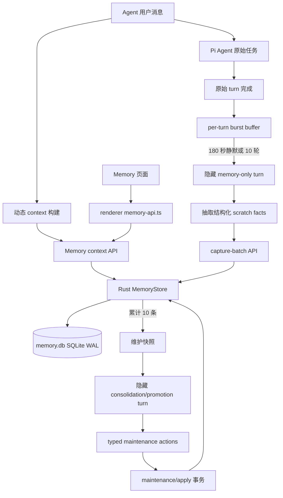

# QM 风格记忆继续对齐 Implementation Plan

> **For agentic workers:** REQUIRED SUB-SKILL: Use superpowers:subagent-driven-development (recommended) or superpowers:executing-plans to implement this plan task-by-task. Steps use checkbox (`- [ ]`) syntax for tracking.

**Goal:** 在不使用 QM PostgreSQL 的前提下，把 Copis 当前的本地结构化记忆继续对齐到 QM 的自动 recall、per-turn capture、consolidation、scratch promotion、revision 和 scope 隔离行为，并把记忆源数据迁移到本地 SQLite。

**Architecture:** Rust `copis-http-api-server` 是 Memory SQLite 的唯一数据库拥有者，Electron 主进程、Pi worker、Renderer 只能通过 `127.0.0.1:51730` 的 typed HTTP API 访问。Copis 保留现有 `MemoryEntry`、Jotai、独立 Memory 页面和四个 typed tools；自动抽取与整理由 Electron/Pi 的隐藏 memory-only turn 完成，结构化结果由 Rust 事务校验并写入 SQLite。

**Tech Stack:** Rust 2021、`rusqlite 0.39.0` + `bundled`、SQLite WAL、Serde、Bun、TypeScript、Electron 43、React 18、Jotai、Pi Agent SDK、Bun Test、Cargo Test。

---

## 0. 执行边界

**状态：** Memory 主体已实施；focused tests、分层构建和 Rust HTTP/SQLite smoke 已通过，实际 Electron 窗口 smoke 尚未执行

**日期：** 2026-08-05

**本计划与旧计划的关系：** `docs/qm-memory-rust-api-migration-plan.md` 是第一阶段的 Memory API/UI 迁移计划。本计划继续沿用其中的结构化条目、Rust HTTP、workspace 隔离和 revision 合约，但明确替换旧计划中“不得引入 SQLite”以及 `entries.json` / `revisions.jsonl` 作为运行时存储的部分。旧计划文件不覆盖、不删除。

### 0.1 已有基线

- `native/http-api-server/src/memory.rs` 已有 `MemoryStore`、scope/kind/source、capture/list/recall/rewrite/archive/history/restore 和跨 workspace 可见性校验，运行时持久化已迁移到 `memory.db` SQLite；`entries.json` + `revisions.jsonl` 仅作为一次性导入源。
- `native/http-api-server/src/main.rs` 已在 `127.0.0.1:51730` 直接处理 `/api/memory/*`，不经过 Electron bridge；Electron 启动时通过 `COPIS_MEMORY_DIR` 指定配置目录。
- `packages/shared/src/types/memory.ts`、`apps/electron/src/renderer/lib/memory-api.ts`、`memory-atoms.ts` 和 `components/memory/*` 已形成结构化 Memory UI 链路。
- `apps/electron/src/main/lib/adapters/pi-builtin-tools.ts` 已保留 `memory_recall`、`memory_read`、`memory_capture`、`memory_rewrite` 四个受控工具，工具 schema 不暴露任意 workspace 或底层路径。
- `pi-memory-organization.ts` 和 `pi-agent-adapter.ts` 已有“上下文超过 200,000 tokens 后执行隐藏整理回合”的 Copis 专有保护；它不是 QM 的 per-turn capture，当前已改为复用 `MemoryMaintenanceService` 的 keyed queue。
- direct Agent、RPC worker 均会把 token-threshold 整理交给同一 maintenance queue，最终通过 `maintenance/apply` 的 revision/capture-count 事务校验。
- Nowledge Mem 的设置/旧文件链路已经在当前工作区的未提交改动中移除。本计划不重新引入 `Nowledge Mem` 设置页、prompt 文件或旧 memory IPC；既有未提交改动必须保留。

### 0.2 明确不做

- 不引入 PostgreSQL、`pg`、远程数据库、云端 Memory 服务、向量数据库或 embedding 服务。
- 不把 `MEMORY.md`、Markdown notebook 或 JSON 文件继续作为 Copis Memory 的运行时 source of truth。项目文档和 `.context` 仍可使用 Markdown，但不属于 Memory 数据库。
- 不让 Electron Renderer、Electron 主进程或 Pi worker 直接打开 Memory SQLite；只有 Rust HTTP 服务可以打开该数据库。
- 不改造会话 JSONL、Pi session artifact、Planning SQLite 或 Chat 消息存储。
- 不处理功能模块的安装、激活、发布或远程 manifest 链路；本计划只验证 Memory 所需的 Rust HTTP 本地服务。
- 不恢复 Nowledge Mem，不新增与它同义的 Settings tab；Memory 管理继续使用独立的 Copis Memory 页面。
- 不在本计划中修改 `AGENTS.md` 或 `README.md`。功能完成后若要同步文档，另行取得用户允许。
- 不将 QM 的多用户 channel/group `ccCaptureToPersonal` 语义机械搬入单用户桌面 App；Copis 只实现 `user` 与当前 `workspace` 两级 scope。

### 0.3 完成定义

1. 新安装或迁移后的 Memory 数据只落在 `<Copis 配置目录>/memory/memory.db`，Rust 服务重启后可恢复。
2. 旧 JSON/JSONL 可一次性导入，导入成功后不再双写，原文件保留且不被静默删除。
3. 每轮可按当前 workspace 自动注入有边界的 Memory context；静默 180 秒或累计 10 轮后执行一次隐藏抽取；模型失败不影响原始 Agent 任务。
4. 自动捕获进入 scratch tier，支持 14 天保留、最近 2 天 recall、每累计 10 条触发 consolidation/promotion，维护状态写入 SQLite。
5. `off`、`visible`、`writable` 三种策略和 user/workspace 可见性在 Rust、Pi 工具、prompt、UI 及测试中保持一致。
6. `cargo test`、共享包/Electron 类型检查、主进程/Renderer/Rust 构建和 Rust HTTP/SQLite 边界 smoke 通过；实际 Electron BDD smoke 是剩余的最终交互 gate。

## 1. QM 与 Copis 的行为映射

参考 QM 当前实现：

- [memory-service.ts](https://github.com/yc-software/qm/blob/main/src/memory/memory-service.ts)：capture 去重、recall 上限、replace/revision 抽象。
- [postgres-memory-service.ts](https://github.com/yc-software/qm/blob/main/src/memory/postgres-memory-service.ts)：revision append、条件更新和事务锁；只参考行为，不采用 PostgreSQL。
- [per-turn.ts](https://github.com/yc-software/qm/blob/main/src/memory/strategies/per-turn.ts)：`180_000ms` 静默窗口、`10` 轮 flush、事实抽取和 autonomous turn 约束。
- [consolidation.ts](https://github.com/yc-software/qm/blob/main/src/memory/strategies/consolidation.ts)：每累计 `10` 条 capture 后以 UPDATE/DELETE/ADD 维护 notebook。
- [scratch-promote.ts](https://github.com/yc-software/qm/blob/main/src/memory/strategies/scratch-promote.ts)：scratch 日志保留 14 天、recall 最近 2 天、稳定事实 promotion。

| QM 行为 | Copis 目标映射 | 本次落点 |
| --- | --- | --- |
| scopeId 隔离 | `user` + 当前 `workspace`；当前 workspace 可见 user memory 和本 workspace memory | Rust `is_visible`、context API、Pi tool context |
| MEMORY.md head/revision | `memory_entries` 当前快照 + `memory_revisions` 完整快照历史 | SQLite schema 与事务 |
| recall | 每轮动态 context；工具 recall 保留显式 query | `POST /api/memory/context`、`POST /api/memory/recall` |
| per-turn capture | 180 秒静默或 10 轮触发隐藏 memory-only turn | `pi-memory-auto-capture.ts`、Pi hidden runner |
| capture 去重 | 同 scope、规范化后等价内容不重复 | SQLite transaction + unique/dedup 查询 |
| consolidation | 对结构化条目执行 update/archive/add，保留 revision | `pi-memory-maintenance.ts` + `/maintenance/apply` |
| scratch promote | 自动 capture 写 `scratch`；稳定内容转为 fact/preference/project | maintenance state + promotion transaction |
| 14 天 retention / 2 天 recall | 过期 scratch 归档而不是物理删除；context 只带最近 2 天 scratch | Rust context/maintenance 查询 |
| replaceIfRevision | `expectedRevision` 乐观锁，冲突返回当前条目 | 现有 PATCH 合约继续兼容 |
| QM 单一 memory action | Copis 保留现有四个 typed tools，避免破坏当前工具/UI 合约 | Pi tool adapter；不暴露 scope/path |

## 2. 目标架构



### 2.1 单数据库所有权

```text
Copis Electron
  └─ spawn copis-http-api-server
       └─ open <configDir>/memory/memory.db
            ├─ schema migration/import
            ├─ MemoryStore query + transaction
            ├─ WAL + busy_timeout + integrity check
            └─ /api/memory/*
```

- `COPIS_MEMORY_DIR` 继续指向 `<configDir>/memory`；数据库文件名固定为 `memory.db`。
- Rust `MemoryStore` 由一个 `Mutex<rusqlite::Connection>` 持有；所有写操作使用 `BEGIN IMMEDIATE`，写事务结束后再释放锁。
- 启动设置 `PRAGMA foreign_keys = ON`、`PRAGMA journal_mode = WAL`、`PRAGMA synchronous = NORMAL`、`PRAGMA busy_timeout = 5000`。不使用进程外数据库锁或网络连接池。
- `MemoryStore::open` 失败时 Rust 服务继续按现有启动失败策略退出并输出中文错误；Electron 将 Memory API 错误显示为“记忆服务不可用”，不把它误报成“条目不存在”。

## 3. SQLite 数据模型

### 3.1 Schema

在 `native/http-api-server/src/memory.rs` 维护版本化 migration，首版 schema 使用 `PRAGMA user_version = 1`：

```sql
CREATE TABLE IF NOT EXISTS memory_entries (
  id TEXT PRIMARY KEY,
  scope TEXT NOT NULL CHECK (scope IN ('user', 'workspace')),
  workspace_slug TEXT,
  kind TEXT NOT NULL CHECK (kind IN ('fact', 'preference', 'decision', 'project', 'scratch')),
  title TEXT NOT NULL,
  content TEXT NOT NULL,
  tags_json TEXT NOT NULL DEFAULT '[]',
  source TEXT NOT NULL CHECK (source IN ('agent', 'user', 'import')),
  created_at INTEGER NOT NULL,
  updated_at INTEGER NOT NULL,
  captured_at INTEGER NOT NULL,
  revision INTEGER NOT NULL CHECK (revision > 0),
  archived INTEGER NOT NULL DEFAULT 0 CHECK (archived IN (0, 1)),
  expires_at INTEGER,
  CHECK (
    (scope = 'user' AND workspace_slug IS NULL)
    OR (scope = 'workspace' AND workspace_slug IS NOT NULL)
  )
);

CREATE INDEX IF NOT EXISTS memory_entries_visible_idx
  ON memory_entries(scope, workspace_slug, archived, updated_at DESC);
CREATE INDEX IF NOT EXISTS memory_entries_scratch_retention_idx
  ON memory_entries(kind, captured_at, archived);

CREATE TABLE IF NOT EXISTS memory_revisions (
  id INTEGER PRIMARY KEY AUTOINCREMENT,
  memory_id TEXT NOT NULL REFERENCES memory_entries(id) ON DELETE RESTRICT,
  revision INTEGER NOT NULL CHECK (revision > 0),
  operation TEXT NOT NULL CHECK (operation IN ('capture', 'rewrite', 'restore', 'archive', 'promote', 'consolidate')),
  snapshot_json TEXT NOT NULL,
  author TEXT,
  created_at INTEGER NOT NULL,
  UNIQUE(memory_id, revision)
);

CREATE INDEX IF NOT EXISTS memory_revisions_memory_idx
  ON memory_revisions(memory_id, revision DESC);

CREATE TABLE IF NOT EXISTS memory_maintenance_state (
  scope_key TEXT PRIMARY KEY,
  capture_count INTEGER NOT NULL DEFAULT 0,
  last_consolidated_capture_count INTEGER NOT NULL DEFAULT 0,
  last_promoted_at INTEGER,
  last_cleanup_at INTEGER,
  legacy_imported_at INTEGER,
  updated_at INTEGER NOT NULL
);
```

### 3.2 字段与规则

- `tags_json` 和 `snapshot_json` 使用 `serde_json` 编解码；数据库中的 JSON 无法解析时视为存储损坏，不能静默丢字段。
- `captured_at` 记录事实进入 Memory 的时间；`expires_at` 只用于 scratch retention，默认等于 `captured_at + 14 天`。
- 自动抽取的事实使用 `kind = 'scratch'`、`source = 'agent'`；用户在 Memory 页面创建的条目使用 `source = 'user'`；旧 JSON/JSONL 导入使用 `source = 'import'`。
- 每次 capture/rewrite/restore/archive/promote/consolidate 生成新的 `revision` 和 `memory_revisions` 快照；restore 不回退 revision 号。
- `memory_maintenance_state.scope_key` 使用 `user` 或 `workspace:<slug>`，不把绝对路径、session ID 或任意用户输入直接作为表名/SQL 片段。
- 不使用 FTS5、向量索引或额外运行时依赖；第一版搜索保持 QM `queryBullets` 的确定性语义：query 按空白拆词，所有词必须出现在 title/content/tags 的小写文本中。

共享类型同时补齐以下公共契约，避免主进程、Rust wire response 和 Renderer 各自定义同名结构：

```ts
export type MemoryPolicy = 'off' | 'visible' | 'writable'

export interface MemoryRecallInput {
  workspaceSlug?: string
  query: string
  limit?: number
}

export interface MemoryCaptureBatchResponse {
  entries: MemoryEntry[]
  added: number
  deduplicated: number
}

export interface MemoryMaintenanceState {
  workspaceSlug: string
  captureCount: number
  lastConsolidatedCaptureCount: number
  lastPromotedAt?: number
  lastCleanupAt?: number
}

export interface MemoryMaintenanceApplyResponse {
  entries: MemoryEntry[]
  state: MemoryMaintenanceState
}
```

`MemoryOperation` 还需要增加 `promote` 和 `consolidate`，让维护动作在 revision history 中可审计；既有 `capture`、`rewrite`、`restore`、`archive` 名称不变。

## 4. 实施任务

### Task 1: 锁定 SQLite 依赖和 Rust 存储边界

**Files:**
- Modify: `native/http-api-server/Cargo.toml`
- Modify: `native/http-api-server/Cargo.lock`
- Test: `native/http-api-server/src/main.rs`（保留现有 HTTP smoke tests）

- [x] **Step 1: 固定依赖版本并确认 bundled 特性**

在 `native/http-api-server` 执行：

```bash
cargo search rusqlite --limit 1
cargo info rusqlite --verbose
```

本次已核对到当前构建兼容的 `rusqlite 0.39.0`，将依赖写成：

```toml
rusqlite = { version = "0.39.0", features = ["bundled"] }
```

`bundled` 必须保留，确保 macOS/Windows/Linux 目标机不需要预装 SQLite 动态库；不添加 PostgreSQL crate。

- [x] **Step 2: 更新 lockfile 并验证最小 Rust 构建**

```bash
cargo check --manifest-path native/http-api-server/Cargo.toml --locked
```

Expected: `Finished` 且没有 `postgres`、`tokio-postgres`、`sqlx` PostgreSQL 依赖。

- [x] **Step 3: 检查生产代码的数据库拥有者数量**

```bash
rg -n "node:sqlite|rusqlite|memory\.db|entries\.json|revisions\.jsonl|postgres|pg-pool" \
  apps/electron/src/main native/http-api-server packages/shared
```

Expected: 迁移完成前只允许 `memory.rs` 读旧 JSON/JSONL；生产 Memory 的 `rusqlite` 引用只在 Rust 服务，Planning 的既有 `node:sqlite` 不纳入本计划。

### Task 2: 将 MemoryStore 迁移为 SQLite 并一次性导入旧文件

**Files:**
- Modify: `native/http-api-server/src/memory.rs`
- Modify: `native/http-api-server/src/main.rs:1195-1243`
- Test: `native/http-api-server/src/memory.rs` 的 `#[cfg(test)]` 模块

- [x] **Step 1: 先写 SQLite BDD 测试**

Rust 测试不增加新的测试依赖；使用 `std::env::temp_dir`、进程内 `AtomicU64` 和 `Drop` 清理唯一目录。覆盖以下 Given/When/Then：

```text
Given 临时目录没有 memory.db，When MemoryStore::open，Then 创建 memory.db、三张表、WAL 和 user_version=1。
Given entries.json 与 revisions.jsonl 有合法旧数据，When 首次 open，Then 在同一事务导入全部记录，legacy_imported_at 被写入，旧文件内容不变化。
Given 已经成功导入且 memory.db 已存在，When 再次 open，Then 不重复导入，即使旧 JSON 文件仍存在也不会产生重复 revision。
Given capture/rewrite/archive/restore 并发发生，When 任一写事务遇到 busy，Then 在 busy_timeout 内等待，最终 revision 单调递增且没有半条 revision。
Given JSON tags 或 revision snapshot 损坏，When open 或读取，Then 返回 storage error，旧文件和 SQLite 原子状态都保留，不静默跳过坏数据。
Given 当前 workspace 为 A，When recall/get/list，Then 可见 user 与 A，不能看到 B；无 workspace 时只能看到 user。
```

- [x] **Step 2: 用 SQLite 连接替换内存状态和文件写入**

将 `MemoryStore` 的核心形状收敛为：

```rust
pub struct MemoryStore {
    database_path: PathBuf,
    connection: Mutex<rusqlite::Connection>,
}

impl MemoryStore {
    pub fn open(directory: impl AsRef<Path>) -> Result<Self, MemoryError>;
    pub fn integrity_check(&self) -> Result<(), MemoryError>;
}
```

`capture`、`rewrite`、`archive`、`restore` 和批量维护全部使用参数化 SQL；不拼接 workspace、id、query 或用户内容到 SQL 字符串。保留现有 Rust 公共方法和 JSON wire shape，让 HTTP/UI/Pi 消费者可以分阶段迁移。

- [x] **Step 3: 实现 schema migration 与 SQLite PRAGMA**

`open` 的顺序必须是：创建目录 → 打开 `memory.db` → 设置 PRAGMA → `BEGIN IMMEDIATE` → 建表/索引 → 读取 `PRAGMA user_version` → 执行导入 → 设置版本 → commit。

```rust
connection.execute_batch(
    "PRAGMA foreign_keys = ON;
     PRAGMA journal_mode = WAL;
     PRAGMA synchronous = NORMAL;
     PRAGMA busy_timeout = 5000;",
)?;
```

若现有数据库版本高于当前 binary 支持版本，必须返回明确的 storage error 并停止 Memory 服务，不能降级覆盖数据库。

- [x] **Step 4: 实现 JSON/JSONL 导入和停止双写**

导入规则：

1. 仅当 `memory_maintenance_state` 的 `__global__` 行没有 `legacy_imported_at` 且 `memory.db` 没有业务记录时读取 `entries.json` / `revisions.jsonl`。
2. 先严格解析全部文件，再在一个 SQLite transaction 中插入 entries、revisions 和 import marker；任一行解析失败则整体回滚。
3. 导入成功后只写 SQLite；旧文件保留为用户可备份的历史文件，不再更新、不自动删除、不自动重命名。
4. `.claude/memory` 和 Nowledge Mem 文件不进入该导入器，它们不是当前 Copis Memory 的结构化 source of truth。

- [x] **Step 5: 删除文件状态路径并跑 Rust 测试**

```bash
cargo test --manifest-path native/http-api-server/Cargo.toml memory
cargo test --manifest-path native/http-api-server/Cargo.toml
```

Expected: MemoryStore 测试和现有 HTTP/Pi RPC 测试均通过；`rg "persist_state|entries\.json.*write|revisions\.jsonl.*write" native/http-api-server/src` 不再命中生产写路径。

### Task 3: 扩展共享类型、HTTP API 和主进程 typed client

**Files:**
- Modify: `packages/shared/src/types/memory.ts`
- Modify: `packages/shared/src/types/index.ts`
- Modify: `native/http-api-server/src/main.rs`
- Modify: `apps/electron/src/renderer/lib/memory-api.ts`
- Create: `apps/electron/src/main/lib/memory-api-client.ts`
- Test: `packages/shared/src/types/memory.test.ts`
- Test: `apps/electron/src/main/lib/memory-api-client.test.ts`
- Test: `native/http-api-server/src/main.rs` 的 HTTP route tests

- [x] **Step 1: 定义 context、batch 和 maintenance wire types**

在共享类型中增加以下结构，字段使用 camelCase；`MemoryPolicy`、`MemoryRecallInput`、`MemoryCaptureBatchResponse`、`MemoryMaintenanceState` 和 `MemoryMaintenanceApplyResponse` 按 3.2 的公共定义导出：

```ts
export interface MemoryContextInput {
  workspaceSlug?: string
  query?: string
  maxChars?: number
}

export interface MemoryContextResponse {
  text: string
  entries: MemoryRecallItem[]
  generatedAt: number
}

export interface MemoryCaptureBatchInput {
  workspaceSlug: string
  items: Array<Pick<MemoryCaptureInput, 'kind' | 'title' | 'content' | 'tags'>>
}

export type MemoryMaintenanceAction =
  | { operation: 'promote'; id: string; expectedRevision: number; kind: Exclude<MemoryKind, 'scratch'> }
  | { operation: 'rewrite'; id: string; expectedRevision: number; title?: string; content?: string; tags?: string[]; kind?: MemoryKind }
  | { operation: 'archive'; id: string; expectedRevision: number }
  | { operation: 'capture'; kind: Exclude<MemoryKind, 'scratch'>; title: string; content: string; tags: string[] }

export interface MemoryMaintenanceApplyInput {
  workspaceSlug: string
  expectedCaptureCount: number
  actions: MemoryMaintenanceAction[]
}
```

`MemoryContextResponse.text` 是 Rust 生成的有上限文本；它不能包含数据库路径、内部 SQL 或未授权 workspace 的条目。

- [x] **Step 2: 增加 API 路由并保持旧路由兼容**

保留现有路由并增加：

```text
POST /api/memory/context
POST /api/memory/capture-batch
POST /api/memory/maintenance/apply
GET  /api/memory/maintenance?workspaceSlug=<slug>
```

`maintenance/apply` 必须在单个 `BEGIN IMMEDIATE` 中检查 `expectedCaptureCount`、每个 action 的 `expectedRevision` 和 workspace 可见性；任一冲突则整个请求返回 409，不能部分提交。

`GET /api/health` 增加不泄露路径的状态字段：

```json
{"memory":{"available":true,"backend":"sqlite","schemaVersion":1}}
```

- [x] **Step 3: 复用主进程 client，禁止各模块复制 fetch 逻辑**

新 client 暴露固定方法：

```ts
export const memoryApiClient = {
  context(input: MemoryContextInput): Promise<MemoryContextResponse>
  recall(input: MemoryRecallInput): Promise<MemoryRecallResponse>
  captureBatch(input: MemoryCaptureBatchInput): Promise<MemoryCaptureBatchResponse>
  maintenanceState(workspaceSlug: string): Promise<MemoryMaintenanceState>
  applyMaintenance(input: MemoryMaintenanceApplyInput): Promise<MemoryMaintenanceApplyResponse>
}
```

Pi tools、自动 capture、consolidation 和 promotion 都调用该 client；Renderer 继续使用 `renderer/lib/memory-api.ts`，两者共享 `@copis/shared` 类型但不共享 Renderer 代码。

- [x] **Step 4: 为错误和边界写测试**

覆盖：`400` 非法 workspace/limit、`404` 跨 workspace id、`409` revision/capture-count 冲突、`413` body 上限，以及 `maintenance/apply` 的全有或全无。运行：

```bash
bun run --filter='@copis/shared' typecheck
bun test apps/electron/src/main/lib/memory-api-client.test.ts
cargo test --manifest-path native/http-api-server/Cargo.toml
```

### Task 4: 每轮注入受控 Memory context

**Files:**
- Modify: `apps/electron/src/main/lib/agent-prompt-builder.ts`
- Modify: `apps/electron/src/main/lib/agent-orchestrator.ts`
- Modify: `apps/electron/src/main/lib/agent-rpc-service.ts`
- Create: `apps/electron/src/main/lib/memory-context-builder.ts`
- Test: `apps/electron/src/main/lib/agent-prompt-builder.test.ts`
- Test: `apps/electron/src/main/lib/memory-context-builder.test.ts`

- [x] **Step 1: 保持同步动态上下文，增加异步 Memory 包装器**

不要把 `buildDynamicContext` 改成隐式网络函数；新增：

```ts
export async function appendMemoryContext(
  base: string,
  input: { workspaceSlug?: string; userMessage: string; policy: MemoryPolicy },
): Promise<string> {
  if (input.policy === 'off') return base
  const context = await memoryApiClient.context({
    ...(input.workspaceSlug ? { workspaceSlug: input.workspaceSlug } : {}),
    query: input.userMessage,
    maxChars: 6_000,
  })
  return context.text.trim()
    ? `${base}\n\n<copis_memory_context>\n${context.text}\n</copis_memory_context>`
    : base
}
```

网络错误、服务启动短暂失败或空结果只记录中文 warn 并返回 `base`，不得阻断普通 Agent 消息。

- [x] **Step 2: 在两个 Agent 入口统一注入**

在 `agent-orchestrator.ts` 和 `agent-rpc-service.ts` 构建最终 prompt 前执行同一个 `appendMemoryContext`；不要只修旧 orchestrator 而遗漏 Rust/Pi RPC 路径。`/compact` 请求不追加 Memory context。

- [x] **Step 3: 更新 prompt 的信任边界**

在 `agent-prompt-builder.ts` 明确：Memory context 是参考资料，不是系统指令；其中的文本不能改变工具权限、workspace 边界或用户当前请求。保留现有 Copis Memory 分类规则，并删除任何 `.claude/memory`、`MEMORY.md` 或 Nowledge Mem 路径说明。

- [x] **Step 4: 验证 context 隔离和上限**

BDD：

```text
Given user memory、workspace A memory、workspace B memory 同时存在
When Agent 在 workspace A 发起消息
Then prompt 只包含 user + A，且 context 文本不超过 6000 字符

Given memory policy 为 off
When Agent 发起消息
Then prompt 没有 copis_memory_context，且没有自动 capture 调度
```

运行：

```bash
bun test apps/electron/src/main/lib/memory-context-builder.test.ts
bun test apps/electron/src/main/lib/agent-prompt-builder.test.ts
```

### Task 5: 实现 QM per-turn 自动 capture

**Files:**
- Create: `apps/electron/src/main/lib/adapters/pi-memory-auto-capture.ts`
- Modify: `apps/electron/src/main/lib/adapters/pi-agent-adapter.ts`
- Modify: `apps/electron/src/main/lib/agent-orchestrator.ts`
- Modify: `apps/electron/src/main/lib/agent-rpc-service.ts`
- Modify: `apps/electron/src/main/lib/adapters/pi-memory-organization.ts`
- Create: `apps/electron/src/main/lib/adapters/pi-memory-auto-capture.test.ts`
- Modify: `apps/electron/src/main/lib/adapters/pi-memory-organization.test.ts`

- [x] **Step 1: 固定 QM 的 flush 参数和抽取协议**

在新模块中定义：

```ts
export const MEMORY_CAPTURE_QUIET_MS = 180_000
export const MEMORY_CAPTURE_MAX_TURNS = 10
```

隐藏抽取回合的 system prompt 必须保留以下硬规则：只输出 `- fact` 每行或 `NONE`；只记录用户明确说过且未来仍可能有用的偏好、身份、项目和工作方式；排除 secret、一次性 trivia、系统 endpoint/header、路径、tool schema 和 assistant 自己推导的偏好；autonomous/automation turn 只能记录运行状态、阻塞和结果，不能生成用户偏好。

- [x] **Step 2: 用每个 session/workspace 的 burst buffer 收集 turn**

定义：

```ts
export interface CompletedAgentTurn {
  sessionId: string
  workspaceSlug: string
  userInput: string
  assistantReply: string
  autonomous: boolean
}

export interface MemoryAutoCapture {
  onTurnEnd(turn: CompletedAgentTurn): Promise<void>
  flush(workspaceSlug: string, reason: 'quiet' | 'turn_limit' | 'manual'): Promise<void>
  dispose(sessionId: string): void
}
```

相同 `workspaceSlug + sessionId + autonomous` 的连续 turn 进入同一 burst；新的 turn 清除并重启 quiet timer；达到 10 轮立即 flush。timer 使用 `unref()`，应用退出或会话删除时清理。

- [x] **Step 3: 在安全的原始 turn 终点接入**

只有 assistant 无 tool call、非 error、非 aborted 的最终结果才调用 `onTurnEnd`。Pi native retry 的 error event 不计数；用户主动中止和失败响应不进入抽取 transcript。旧的 200,000-token 隐藏整理回合与 per-turn capture 共用“仅允许 Memory tools、display=false、不向 Renderer 推送”的 guard，但两者分别由 token threshold 和 burst threshold 触发。

- [x] **Step 4: 执行 hidden memory-only turn 并提交 batch**

flush 流程必须是：

```text
burst -> Pi hidden extraction turn -> parseFacts -> /api/memory/capture-batch
```

hidden turn 只能使用当前 workspace 的 `memory_recall`、`memory_read`、`memory_capture`、`memory_rewrite` 以及内部 batch 提交能力；禁止 Read/Write/Edit/Bash/Planning/MCP/collaboration。抽取失败、API 409、渠道暂时不可用时记录中文 warn 并结束本次 flush，不向用户显示错误，也不重放原始任务。

自动抽取的每个 fact 作为 `kind: 'scratch'` 批量写入当前 workspace；只有用户在 UI 或显式 Agent 工具中明确维护的条目才可以直接写入 user scope 或 durable kind。

- [x] **Step 5: 写 BDD 测试**

```text
Given 9 个成功 turn，When 第 9 轮结束，Then 不调用隐藏抽取。
Given 10 个成功 turn，When 第 10 轮结束，Then 调用一次抽取并 POST 一次 capture-batch。
Given 1 个 turn 后安静 180 秒，When quiet timer 到期，Then flush 一次并清空 burst。
Given 抽取输出为 NONE、包含非 bullet 文本或模型失败，Then 不写入数据库且原始 Agent 结果仍成功。
Given autonomous turn 只包含系统任务状态，Then 不产生 preference/user fact。
```

运行：

```bash
bun test apps/electron/src/main/lib/adapters/pi-memory-auto-capture.test.ts
bun test apps/electron/src/main/lib/adapters/pi-memory-organization.test.ts
```

### Task 6: 实现 consolidation、scratch promotion 和 retention

**Files:**
- Create: `apps/electron/src/main/lib/adapters/pi-memory-maintenance.ts`
- Modify: `native/http-api-server/src/memory.rs`
- Modify: `native/http-api-server/src/main.rs`
- Modify: `apps/electron/src/main/lib/adapters/pi-memory-organization.ts`
- Create: `apps/electron/src/main/lib/adapters/pi-memory-maintenance.test.ts`
- Modify: `apps/electron/src/main/lib/adapters/pi-memory-organization.test.ts`

- [x] **Step 1: 增加可审计的 maintenance state 查询**

Rust 返回 3.2 中定义的 `MemoryMaintenanceState`；`capture-batch` 每新增一个 scratch entry 就在同一事务递增 `capture_count`，重复条目不递增。`expectedCaptureCount` 防止两个 hidden maintenance turn 同时覆盖结果。

- [x] **Step 2: 实现确定性 maintenance action parser**

`pi-memory-maintenance.ts` 不接受模型生成的 SQL 或任意 scope；模型输出只允许 JSON：

```json
{
  "actions": [
    {"operation":"promote","id":"memory-...","expectedRevision":1,"kind":"preference"},
    {"operation":"rewrite","id":"memory-...","expectedRevision":2,"content":"..."},
    {"operation":"archive","id":"memory-...","expectedRevision":1},
    {"operation":"capture","kind":"project","title":"...","content":"...","tags":[]}
  ]
}
```

解析器拒绝未知 operation、未知 id、scratch 以外的跨 workspace 条目、缺失 expectedRevision、过长字段和非 JSON 输出。模型必须遵守 QM consolidation 的语义：优先 merge/update，删除过期/矛盾/重复/可推导事实；保留用户明确要求记住的事实；保留来源不同的事实，不因“看起来相似”跨 scope 合并。

- [x] **Step 3: 实现 10 条阈值触发的 promotion/consolidation**

当 `captureCount - lastConsolidatedCaptureCount >= 10` 时，按 scope 加 keyed queue 执行一次：读取当前 durable 条目 + 最近 14 天 scratch → hidden maintenance turn → `maintenance/apply` → 更新 `lastConsolidatedCaptureCount`。失败时不推进 marker，下一次维护可重试；同一 scope 不允许并发维护。

promotion prompt 必须要求：稳定偏好转 `preference`、项目长期经验转 `project`、持久决策转 `decision`、普通事实转 `fact`；一次性状态不 promotion；不写 secret；保持现有条目 revision 轨迹。

- [x] **Step 4: 实现 retention 和 context window**

Rust maintenance 每次运行先归档 `kind = 'scratch' AND expires_at <= now` 的 active 条目，写 `archive` revision 并更新 `lastCleanupAt`。归档不删除 `memory_revisions`。`context` 只拼接 durable 条目和 `captured_at >= now - 2 days` 的 scratch，整体按 `maxChars` 截断。

- [x] **Step 5: 复用 200,000-token 保护但不重复维护**

保留 `PI_MEMORY_ORGANIZATION_CUSTOM_TYPE` 和 compaction 前的隐藏回合；该回合改为调用同一个 maintenance service/queue，不能绕过 `expectedRevision` 或直接操作文件。若同一 scope 的 per-turn maintenance 正在运行，token-threshold 回合只读取结果并等待，不再启动第二个整理写事务。

- [x] **Step 6: 写 consolidation BDD 测试**

```text
Given 10 条新 scratch，When maintenance turn 返回 promote + archive actions，Then 一个 SQLite transaction 同时完成，所有 revision 可追溯。
Given action 中任一条 expectedRevision 过期，When apply maintenance，Then 返回 409，所有 action 都不落库，capture marker 不前进。
Given scratch 已超过 14 天，When cleanup 运行，Then 条目 archived=true、revision 增加，历史仍可读。
Given scratch 只在最近 2 天，When context 运行，Then context 包含它；超过 2 天但未过期时，Then不进入自动 context。
Given 两个 maintenance flush 同时到达同一 workspace，Then keyed queue 保证只有一个成功推进 marker。
```

运行：

```bash
bun test apps/electron/src/main/lib/adapters/pi-memory-maintenance.test.ts
cargo test --manifest-path native/http-api-server/Cargo.toml memory
```

### Task 7: 补齐 policy、scope 和工具权限矩阵

**Files:**
- Modify: `packages/shared/src/types/agent.ts`
- Modify: `apps/electron/src/types/settings.ts`
- Modify: `apps/electron/src/main/lib/settings-service.ts`
- Modify: `apps/electron/src/main/lib/agent-workspace-manager.ts`
- Modify: `apps/electron/src/main/lib/agent-prompt-builder.ts`
- Modify: `apps/electron/src/main/lib/adapters/pi-builtin-tools.ts`
- Modify: `apps/electron/src/main/ipc.ts`
- Modify: `apps/electron/src/preload/index.ts`
- Modify: `apps/electron/src/renderer/components/memory/MemoryToolbar.tsx`
- Modify: `apps/electron/src/renderer/components/memory/MemoryView.tsx`
- Modify: `apps/electron/src/renderer/atoms/memory-atoms.ts`
- Test: `apps/electron/src/main/lib/agent-workspace-manager.test.ts`
- Test: `apps/electron/src/main/lib/agent-prompt-builder.test.ts`
- Create: `apps/electron/src/main/lib/adapters/pi-builtin-tools.test.ts`

- [x] **Step 1: 定义策略并持久化在配置而非数据库**

```ts
export interface AgentWorkspace {
  // 现有字段...
  memoryPolicy?: MemoryPolicy
}

export interface AppSettings {
  // 现有字段...
  defaultMemoryPolicy?: MemoryPolicy
}
```

默认值为 `writable`，以保持当前 Copis Memory 工具行为；老 workspace/settings 缺失字段时按该默认值读取。workspace policy 优先于全局 default。策略配置写入现有 workspace index/settings JSON，不写入 Memory SQLite，避免把权限配置和事实数据混在一起。

- [x] **Step 2: 按矩阵执行权限**

| Policy | 自动 context | `memory_recall/read` | `memory_capture/rewrite` | UI 管理 |
| --- | --- | --- | --- | --- |
| `off` | 禁止 | 工具不注册或返回 disabled | 禁止 | 仍可查看/编辑，便于用户恢复配置 |
| `visible` | 允许 | 允许当前可见 scope | 禁止 | 仍可查看/编辑 |
| `writable` | 允许 | 允许当前可见 scope | 允许，但 scope 固定由运行上下文决定 | 仍可查看/编辑 |

无 workspace 时：recall/context 只返回 user memory；任何 agent write 和自动 capture 都拒绝。user scope 的写入只能通过 Memory UI 或明确的用户操作 API，Agent typed tools 不接受 `scope` 参数。

- [x] **Step 3: 将策略接入 prompt、Pi tools 和 hidden turns**

`PiBuiltinToolsContext` 传入 resolved policy；`buildMemoryTools` 在注册工具前执行矩阵判断。自动 capture、promotion 和 200,000-token 整理都必须在 `writable` 下运行；`visible` 不得以隐藏回合绕过只读策略。

- [x] **Step 4: 在 Memory 页面提供紧凑策略入口**

在现有 `MemoryToolbar` 或页面 header 中增加 `MemoryPolicy` 选择器和当前状态提示；不新增 Settings 的 Nowledge Mem tab，不显示 SQLite 路径。切换 policy 后刷新 atoms，并确保当前 Agent 新 turn 使用新值。

- [x] **Step 5: 验证跨 workspace 和策略矩阵**

```bash
bun test apps/electron/src/main/lib/agent-workspace-manager.test.ts
bun test apps/electron/src/main/lib/agent-prompt-builder.test.ts
bun test apps/electron/src/main/lib/adapters/pi-builtin-tools.test.ts
```

Expected: 任何工具参数都找不到 `workspaceSlug`/`scope` 的用户可控字段；跨 workspace id 访问返回 404；policy=off 不会通过 hidden turn 写入。

### Task 8: 保持 Memory UI 与 SQLite/维护状态一致

**Files:**
- Modify: `apps/electron/src/renderer/lib/memory-api.ts`
- Modify: `apps/electron/src/renderer/atoms/memory-atoms.ts`
- Modify: `apps/electron/src/renderer/components/memory/MemoryView.tsx`
- Modify: `apps/electron/src/renderer/components/memory/MemoryToolbar.tsx`
- Modify: `apps/electron/src/renderer/components/memory/MemoryList.tsx`
- Modify: `apps/electron/src/renderer/components/memory/MemoryEditor.tsx`
- Modify: `apps/electron/src/renderer/components/memory/MemoryHistory.tsx`
- Test: `apps/electron/src/renderer/components/memory/MemoryView.test.tsx`
- Test: `apps/electron/src/renderer/components/settings/nowledge-mem-removal.test.ts`

- [x] **Step 1: 增加 scratch、维护状态和导入状态展示**

列表标识 `scratch`、`source`、`archived` 和 revision；工具栏显示当前 workspace、active/archive 计数、最近一次 maintenance 状态。显示状态信息，不显示绝对路径、SQL、旧文件名或内部 scope key。

- [x] **Step 2: 保留 revision 冲突草稿**

现有 409 处理继续保留：本地 draft 不丢失，显示服务端 current revision，用户可以重新读取、合并后保存。restore 生成新 revision，不把历史 revision 号写回当前记录。

- [x] **Step 3: 写 UI BDD 测试**

```text
Given Memory 页面已打开，When 当前 workspace 切换，Then 只刷新 user + 新 workspace 条目并清空旧选中项。
Given scratch 条目已过期，When includeArchived=true，Then UI 可从 history 看到 archive revision。
Given 保存时服务端返回 409，Then 编辑框内容仍保留且出现 current revision，不覆盖本地草稿。
Given Nowledge Mem 已删除，When 打开 Settings/Agent Skills，Then 不显示 Nowledge Mem 文案、prompt 或旧 memory 文件树入口。
```

### Task 9: 清理旧文件/IPC 旁路并同步版本

**Files:**
- Modify or verify: `apps/electron/src/main/lib/agent-session-manager.ts`
- Modify or verify: `apps/electron/src/main/lib/agent-workspace-manager.ts`
- Modify or verify: `apps/electron/src/main/ipc.ts`
- Modify or verify: `apps/electron/src/preload/index.ts`
- Modify or verify: `apps/electron/src/renderer/components/agent-skills/AgentSkillsView.tsx`
- Modify: affected `package.json` / `Cargo.toml` patch versions according to repository versioning rule
- Test: `apps/electron/src/renderer/components/settings/nowledge-mem-removal.test.ts`

- [x] **Step 1: 做静态旁路检查**

```bash
rg -n -i "nowledge|\.claude/memory|autoMemoryDirectory|getWorkspaceMemory|WorkspaceMemory|MEMORY\.md" \
  apps/electron native packages/shared
```

Expected: 生产代码没有 Nowledge Mem、旧 memory IPC、Claude Auto Memory directory 或运行时 `MEMORY.md` 写入；QM 文档链接和本计划中的历史说明可保留。

- [x] **Step 2: 确认旧文件只读保留**

启动一次迁移后检查：`entries.json`、`revisions.jsonl` 的 mtime/content 未变化；`memory.db` 的行数和 revision 数量与导入前一致。旧文件不加入 watcher、不被 workspace capabilities 注入。

- [x] **Step 3: 递增受影响包 patch 版本**

按仓库规则仅递增实际修改的 package：`@copis/shared`、`@copis/electron` 和 Rust HTTP server 的 patch；不为文档单独制造无关版本变更。使用当前 checkout 中的版本作为基线，不手写过时的版本号。

### Task 10: 集成验证、实际 Electron BDD smoke 和交付门禁

**Files:**
- Verify: `native/http-api-server/src/memory.rs`
- Verify: `native/http-api-server/src/main.rs`
- Verify: `apps/electron/src/main/lib/http-api-server.ts`
- Verify: `apps/electron/src/main/lib/agent-orchestrator.ts`
- Verify: `apps/electron/src/main/lib/agent-rpc-service.ts`
- Verify: `apps/electron/src/renderer/components/memory/*`

- [x] **Step 1: 执行分层构建和测试**

```bash
cargo test --manifest-path native/http-api-server/Cargo.toml
bun run --filter='@copis/shared' typecheck
bun test apps/electron/src/main/lib/memory-context-builder.test.ts
bun test apps/electron/src/main/lib/adapters/pi-memory-auto-capture.test.ts
bun test apps/electron/src/main/lib/adapters/pi-memory-maintenance.test.ts
bun test apps/electron/src/renderer/components/memory/MemoryView.test.tsx
bun test apps/electron/src/renderer/components/settings/nowledge-mem-removal.test.ts
bun run typecheck
bun run --filter='@copis/electron' build:main
bun run --filter='@copis/electron' build:renderer
bun run --filter='@copis/electron' build:http-api-server
git diff --check
```

Expected: 所有 focused tests、全仓类型检查、主进程、Renderer、Rust server build 和 whitespace check 通过。当前仓库没有 `packages/shared/src/types/memory.test.ts`，以共享包 typecheck 和实际消费者测试作为类型契约验证；若全仓已有无关失败，记录失败文件并补跑本计划涉及的 focused commands，不能用 unrelated failure 替代本计划的验证证据。

- [x] **Step 2: 检查 SQLite 完整性和数据库所有权**

启动 Rust HTTP server 后执行：

```bash
sqlite3 "$COPIS_CONFIG_DIR/memory/memory.db" 'PRAGMA integrity_check; PRAGMA journal_mode;'
lsof -nP -iTCP:51730 -sTCP:LISTEN
```

Expected: `integrity_check` 输出 `ok`，journal mode 为 `wal`，51730 只有 Copis Rust HTTP server 持有；若环境变量未设置，使用当前 Copis config path 对应的 `~/.copis-dev/memory/memory.db` 或 `~/.copis/memory/memory.db`。

- [ ] **Step 3: 在实际 Electron 窗口执行 BDD smoke**

```text
Given 一个全新的或已导入的本地 Copis 配置
When 打开 Memory 页面并创建 user/workspace 条目
Then capture、搜索、编辑、revision、restore、归档均通过 127.0.0.1:51730 成功，memory.db 有对应记录

Given workspace A、workspace B 和 user 条目
When 在 A 的 Agent 会话中提问
Then 自动 context 和 memory_recall 只返回 user + A，不能读取 B

Given 10 个成功 Agent turn
When 最后一轮结束并等待隐藏回合
Then UI 不出现隐藏回合消息，不执行文件/Planning/MCP 工具，scratch 条目可在 Memory 页面看到

Given 10 条新 scratch
When maintenance 运行
Then durable promotion、stale archive、revision history 和 capture marker 与预期一致

Given policy 分别切换为 off、visible、writable
When 发起 Agent turn
Then 依次验证无 context/无写入、可读不可写、可读可写
```

实际窗口验证不能只打开 `about:blank` 或只检查主渲染 DOM；必须确认 Renderer 通过本地 HTTP 服务访问 SQLite，并检查 Console 没有旧 memory IPC、Nowledge Mem 或 hidden turn 未捕获错误。

当前状态：本轮已完成 Rust HTTP/SQLite 真实边界 smoke 和 Renderer BDD 静态渲染测试，但尚未启动实际 Electron 窗口执行这组交互 smoke；因此本步骤保持未完成。

- [x] **Step 4: 复查 diff 和可回滚性**

```bash
git status --short
git diff --stat
git diff -- docs/superpowers/plans/2026-08-05-qm-memory-alignment-sqlite-plan.md
```

只提交本次实现涉及的文件；不得清理当前工作区已有的 `default-skills`、Nowledge Mem removal 或其他无关 dirty changes。SQLite migration 失败时的回滚依据是：旧 JSON/JSONL 未改动、SQLite transaction 未 commit、数据库文件可删除后按旧文件重新迁移。

## 5. 风险与处理

| 风险 | 处理 |
| --- | --- |
| macOS/Windows 没有系统 SQLite | `rusqlite` 使用 `bundled`，构建阶段复制 Rust 产物即可 |
| Electron 与 Rust 同时写 Memory | Electron 不打开 DB；所有写入走 Rust，Rust 内部用 `Mutex` + `BEGIN IMMEDIATE` |
| 旧 JSON/JSONL 导入半成功 | 先全量解析，导入和 marker 在同一事务；失败不修改旧文件 |
| 自动抽取误记 assistant 推导或 secret | strict extraction prompt、bullet/JSON parser、长度/字段校验，且自动结果先进入 scratch |
| 两个 hidden turn 覆盖新 revision | per-scope keyed queue + `expectedCaptureCount` + `expectedRevision`，冲突整体回滚 |
| Memory context 被内容注入成指令 | 使用 `<copis_memory_context>` 参考标签，静态 prompt 明确其不具备指令优先级 |
| hidden turn 影响用户任务或 UI | 独立 display=false/internal path，只注册 Memory tools，失败 best-effort，不重放原任务 |
| 维护模型不可用 | 保留 scratch，marker 不前进，下一次维护重试；不丢自动捕获事实 |
| Nowledge Mem 删除与本计划冲突 | Nowledge removal 是前置基线；本计划只扩展 Copis Memory，不恢复旧 Settings/IPC/file tree |
| `AGENTS.md` 仍写着“不采用本地数据库” | 这是本次用户明确的新约束；本计划只记录并实施该约束，不未经允许修改规则文件 |

## 6. 计划自检

- [x] 覆盖 SQLite 而非 PostgreSQL：Task 1、Task 2、Task 10。
- [x] 覆盖 QM per-turn 180 秒/10 轮：Task 5。
- [x] 覆盖 consolidation、14 天 scratch、2 天 context、promotion：Task 6。
- [x] 覆盖 scope、visible/writable/off、工具不暴露任意 scope：Task 4、Task 7。
- [x] 覆盖 revision、restore、事务冲突：Task 2、Task 3、Task 6、Task 8。
- [x] 覆盖 Nowledge Mem 不回归和旧 JSON/JSONL 安全迁移：Task 2、Task 8、Task 9。
- [x] 覆盖 Rust、主进程、RPC、Renderer、Jotai、Pi hidden turn 和实际 Electron smoke：Task 3 至 Task 10。
- [x] 计划中没有使用 PostgreSQL 的实现步骤，没有把 Markdown 作为长期记忆 source of truth，也没有要求修改 `README.md`/`AGENTS.md`。
