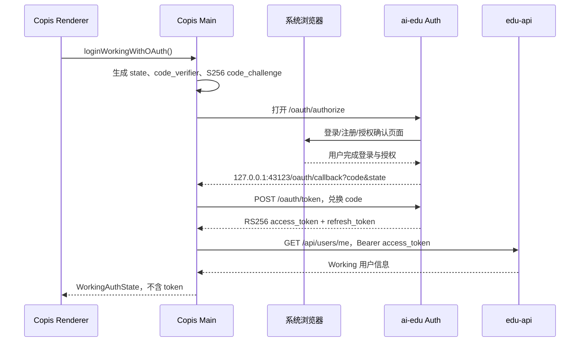

# Copis 与 ai-edu OIDC 登录接入设计

日期：2026-08-18  
状态：已确认，进入实现

## 目标

将 Copis Working 的账号登录切换为 ai-education Auth 模块提供的 OIDC Authorization Code + PKCE 流程，使 Copis 与 ai-edu 使用同一套用户、密码、注册和会话授权体系。

## 当前事实

- Auth issuer：`https://edu-api.meetlife.com.cn:9001/module/auth`
- OAuth public client：`copis-desktop`
- 已注册回调：`http://127.0.0.1:43123/oauth/callback`
- Auth access token：RS256，audience 为 `edu-api`，默认短时有效。
- Auth refresh token：opaque token，通过 Auth `/oauth/token` 轮换。
- Copis 当前登录仍调用 `/api/auth/login`，刷新仍调用 `/api/auth/refresh`。
- `edu-api` 当前 `AuthMiddleware` 只验证旧 HS256 token，必须增加 Auth RS256/JWKS 验证，否则 Copis 虽能完成 OAuth 登录，业务请求仍会返回 401。

## 设计

### Copis 登录流程

Copis renderer 只调用高层 IPC，不接收密码、授权码、Access Token 或 Refresh Token。主进程执行以下流程：



### 回调安全

- 每次登录生成不可预测的 `state` 和 PKCE `code_verifier`。
- 回调只接受一次请求，必须精确校验 `state`。
- 回调 URI 固定为 `http://127.0.0.1:43123/oauth/callback`，与 Auth 注册的 URI 精确一致。
- 回调服务器在成功、错误、取消或超时后关闭。
- 授权 URL 不包含密码、Access Token、Refresh Token 或 Client Secret。
- 系统浏览器由主进程 `shell.openExternal` 启动，不使用 Electron 内嵌 WebContents 承载登录。

### 本地凭据

现有 `~/.copis/working-auth.json` 继续作为存储位置，并通过 Electron `safeStorage` 加密 Access Token 和 Refresh Token。认证记录增加 provider 标记，用于区分：

- `oidc`：刷新调用 Auth issuer 的 `/oauth/token`。
- `legacy`：迁移期仍可刷新旧 HS256 token。

Copis 不再创建旧登录 token；已经存在的旧 token 在迁移期仍可使用，直到刷新或重新登录。

### Renderer 登录入口

现有全屏双栏登录页保留左侧 Copis 产品展示，但右侧改为单一的“使用 ai-edu 账号登录”入口。注册、密码找回和密码输入全部在 Auth 浏览器页面完成。OAuth 取消、超时、state 不匹配、服务端错误和网络错误都在右侧显示可重试提示。

### edu-api 验证

`edu-api` 的认证中间件按 token header 的算法分流：

- RS256：从配置的 Auth JWKS URL 获取并缓存公钥，校验 `iss`、`aud=edu-api`、`token_type=access`、`sub`、`iat`、`exp` 和 `kid`，再通过 `auth_subjects.subject` 查询本地 `users.id`，将统一的 `user_id`、`email`、`account_type` 和 `role` 写入 Gin context。
- HS256：迁移期保留现有校验逻辑，仅接受旧 `ai-education` issuer 与旧签名密钥生成的 access token。
- 不允许把 RS256 token 降级到 HS256 密钥验证，也不接受 refresh token 访问业务接口。

JWKS 配置使用环境变量 `AUTH_ISSUER`、`AUTH_JWKS_URL`、`AUTH_AUDIENCE` 和可选的 `AUTH_JWKS_CACHE_TTL`。缺少 RS256 配置时不影响旧 token 的本地开发路径；生产部署必须配置完整的 Auth issuer/JWKS/audience。

## BDD 场景

```text
Given Copis 未登录
When 用户点击“使用 ai-edu 账号登录”
Then 主进程生成 state 和 PKCE 参数并打开系统浏览器
And renderer 不接收密码、授权码或 token

Given Auth 返回合法 code 和匹配的 state
When Copis 收到 loopback 回调
Then 主进程使用 code_verifier 兑换 OIDC token
And 加密保存 access token、refresh token 和 provider=oidc
And 使用 access token 获取当前用户后进入 Copis

Given Auth 回调的 state 不匹配
When Copis 处理回调
Then 登录失败并清理临时回调服务器
And 不写入任何 token

Given OIDC access token 即将过期
When Copis 发起下一次 Working 请求
Then 主进程调用 Auth /oauth/token 轮换 refresh token
And 使用新 access token 重试请求

Given edu-api 收到合法 Auth RS256 access token
When token 的 sub 能映射到 auth_subjects
Then 请求以对应 users.id 继续执行

Given edu-api 收到错误 issuer、audience、kid、签名、过期时间或 token_type
When 请求进入受保护路由
Then 返回 401，且不回退到旧 HS256 密钥验证

Given Copis 中仍保存旧 HS256 token
When 迁移期发起 Working 请求
Then edu-api 继续按旧逻辑验证并允许请求
And Copis 的新登录流程不再生成旧 token
```

## 非目标

- 本次不修改 `README.md` 或 `AGENTS.md`。
- 本次不把 OAuth token 暴露给 renderer、Rust bridge 或普通 localStorage。
- 本次不引入新的 OAuth/JOSE 第三方依赖；Copis 使用 Node/Web Crypto 与现有 fetch，edu-api 使用 Go 标准库完成 JWKS/JWT 验证。
- 本次不删除 ai-education 旧 `/api/auth/*` 路由；它们作为迁移期兼容入口保留，后续可单独迁移为 Auth 代理。
