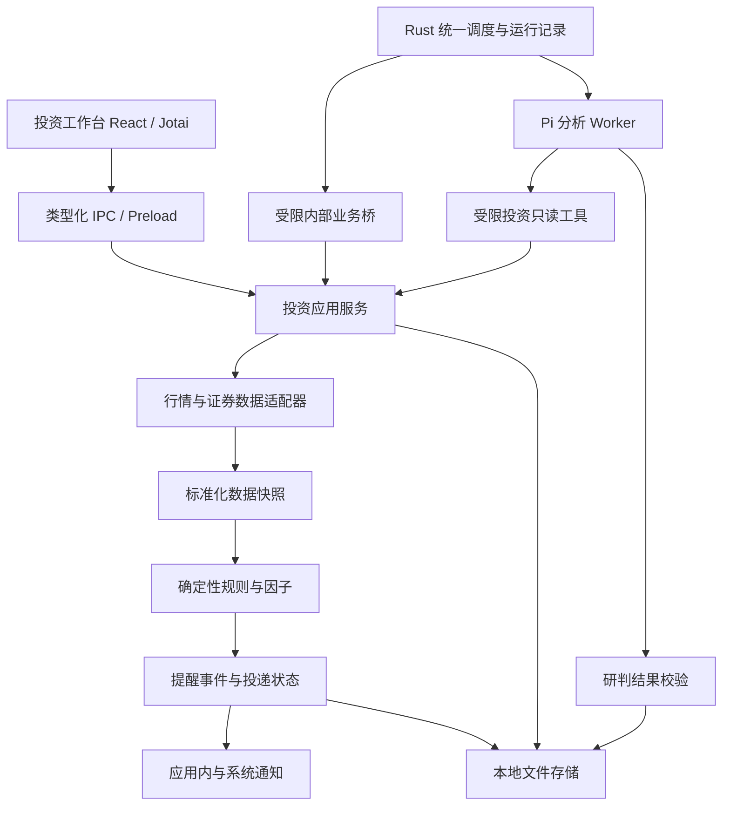

# 我的投资：A 股、港股、美股投研与提醒规格

- 日期：2026-09-08
- 状态：待评审，尚未开始实现
- 目标项目：Copis
- 参考项目：同级目录 `r20-quantum-trader`
- 已确认边界：分析与提醒，用户在券商端手动交易
- 市场解释：本文将用户所说的 H 股按港股市场设计；H 股分类作为证券属性保留，不将香港上市证券全部标记为 H 股。

## 1. 目标与成功标准

将现有“我的投资”从行情展示与投研对话，扩展为“观察、研判、提醒、人工行动、复盘”的个人投资工作台。

首要目标是让用户可靠地追踪自选股票的价格条件，了解数据是否有效、监测是否运行、提醒为何触发。其后增加可追溯的结构化 AI 研判，再引入手工持仓与复盘。

成功标准：

1. 用户可为 A 股、港股、美股自选股票建立提醒，在受支持的交易时段和数据质量条件下收到可解释、可去重的通知。
2. 界面明确区分行情发生时间、获取时间、延迟属性和监测状态，不将旧行情显示为实时行情。
3. 每次 AI 研判可以定位输入快照、因子版本、模板版本、模型配置及证据，不把模型自报置信度解释为获利概率。
4. 应用关闭、电脑休眠、网络故障、数据源限流后，系统能说明监测缺口，并恢复当前检查。
5. 全流程符合 Copis 的 React、Jotai、类型化 IPC、Rust 统一调度与本地文件优先规范。

## 2. 范围与阶段

### 2.1 P1：可靠行情与价格盯盘

P1 是首个可独立交付版本，包含：

- A 股、港股、美股普通股票的明确标的身份与市场分类。
- 数据源能力声明、行情质量状态、来源时间与交易日历。
- 价格上穿、下穿提醒；阈值使用该证券报价币种。
- 仅在用户启用的自选范围内检查，不扫描三市场全量股票。
- 提醒列表、状态、触发历史、暂停、恢复、编辑和删除。
- Copis 应用内通知及系统桌面通知；外部消息渠道留到后续阶段。
- Rust 拥有的确定性任务调度、失败状态、恢复与通知去重。
- 本地配置、事件记录、数据快照及版本迁移。

P1 默认只检查常规连续交易时段；不将集合竞价、盘前、盘后等时段混入规则计算。休市行情仍可展示，并标注市场状态。

现有基金与 ETF 自选、图表和对话继续保留。本次新提醒和结构化研判首先限定为普通股票；其他资产显示未支持原因，不默认为股票规则。

### 2.2 P2：结构化 AI 研判

- 日线、周线为主的趋势、量价、波动率和相对基准强弱分析。
- 技术、基本面、事件风险三类信息的结构化输出。
- 自选投研模板、输入模块、版本归档和回滚。
- 单模型投研、证据核查、观点有效期、条件型观点跟踪。
- 成交量、已完成 K 线、财报和公告事件提醒，按数据源能力逐项开放。
- 盘前摘要、收盘复盘等分析任务，复用 Pi Worker 与现有模型渠道。

### 2.3 P3：个人持仓与复盘

- 手动维护持仓和交易记录，不代表已从券商核实。
- 多币种估值、集中度、持仓相关风险提醒。
- 研判与人工行动对照、后续表现观察、复盘经验审阅。
- 可选多角色投研讨论，以及提醒转发到已配置的外部通知渠道。

### 2.4 本规格不包含

- 券商登录、下单、撤单、自动交易、券商交易页面自动操作。
- 加密货币、期货、期权、杠杆或卖空策略。
- 自建交易撮合、完整模拟账户、完整策略回测引擎。
- 在电脑关闭后继续运行的云端监控服务。
- 重新搭建 R20 的 Vue 前端、FastAPI 服务、Gateway 或 SQLite 数据层。

后续表现观察不等于交易回测：必须标注观察起点、价格口径和缺失数据，不输出未经交易执行模型支持的策略收益率。

## 3. 当前项目事实与约束

以下是设计时核对的源码事实，不代表相关路径已经运行验证：

| 现有位置 | 当前能力 | 本次处理 |
| --- | --- | --- |
| `apps/electron/src/renderer/components/trading/FundStockTerminalView.tsx` | 自选、图表、盘口、投研助手与快捷分析 | 复用入口，按子视图拆分，避免继续扩大单文件 |
| `apps/electron/src/renderer/atoms/trading-atoms.ts` | Jotai 行情与界面状态 | 增加专属提醒和研判 atoms，业务数据经服务落盘 |
| `apps/electron/src/main/lib/trading-quote-service.ts` | 腾讯公开行情、K 线、搜索、自选文件 | 分离数据源适配与标准化，保留现有自选兼容入口 |
| `packages/shared/src/types/fund-stock.ts` | 市场、报价、K 线、自选及 IPC 类型 | 兼容扩展，新增领域类型分文件定义 |
| `apps/electron/src/main/lib/agent-workspace-manager.ts` | 固定 investment 工作区 | 复用实际工作区路径，不硬编码用户目录 |
| `native/http-api-server/src/automation_scheduler.rs` | Rust 统一调度 Pi Worker | 扩展确定性任务类型，保持唯一调度所有者 |
| `apps/electron/src/main/lib/dsh-trading-service.ts` | 只读行情展示 Profile | 保持现有边界，新功能不依赖 DSH 交易服务 |

已发现的接入前置问题：

- 当前报价 `updatedAt` 使用获取时的 `Date.now()`，不能证明行情本身新鲜。
- 当前 `1m` 会映射为 `m5`，新契约禁止静默替换请求周期。
- 当前 K 线可能从其他周期字段回退，新契约必须返回实际周期或拒绝不支持请求。
- 当前数值解析有将缺失数据变为零的路径，规则引擎必须使用显式缺失值。
- 服务注释提及 Yahoo 备用，但已检查的取价实现未见对应备用链路，不能作为既有可靠性承诺。

仓库约束：新增源文件不超过 600 行，不新增 `any`；BDD 验收；新增投资业务数据采用配置文件及 JSONL，不引入新的本地数据库。既有全局记忆数据库不受本规格影响。README 和 AGENTS 的同步修改需在功能实现阶段取得对应授权。

## 4. 架构选择

采用 Copis 原生扩展。R20 提供因子、模板、研判门禁、版本快照和复盘的设计参考，股票业务按 Copis 模块边界重新实现。



### 4.1 所有权与执行边界

- Rust：任务到期判定、任务互斥、运行历史、超时状态、下一次触发时间。
- Electron 主进程投资服务：数据获取与标准化、确定性规则计算、投资业务文件的唯一写入入口。
- Pi Worker：P2/P3 的分析任务，通过受限业务工具读取快照，返回结构化候选结果。
- Renderer：展示和用户操作；不直接读写业务文件，不直接调用外部行情接口，不拥有后台盯盘计时器。
- Preload：暴露类型化业务 API，不暴露任意文件读写或任意内部 HTTP 请求。

Rust 通过现有私有桥接方式调用固定的投资任务操作，不允许调度配置提供任意脚本、命令或路径。价格规则任务不创建 Pi Worker，也不要求配置模型渠道。

较大的因子计算放入受限工作线程，避免阻塞 Electron 主进程；网络请求采用并发限制与超时。工作线程不成为第二套调度器。

### 4.2 建议模块位置

| 建议位置 | 职责 |
| --- | --- |
| `packages/shared/src/types/investment-*.ts` | 标的、快照、规则、报告、任务契约 |
| `apps/electron/src/main/lib/investment/` | providers、market-calendar、snapshot、alerts、store、research 等服务 |
| `apps/electron/src/renderer/components/trading/alerts/` | 提醒列表、编辑器、触发历史 |
| `apps/electron/src/renderer/components/trading/research/` | 研判详情、证据、历史版本 |
| `apps/electron/src/renderer/atoms/investment-*.ts` | 功能状态与 IPC 调用封装 |
| `native/http-api-server/src/` 中独立投资任务模块 | 确定性任务分发及与现有调度的连接 |

以上为新增模块的建议边界；实现时以已有 IPC 注册拆分方式为准。所有新增 IPC 都同步维护 shared、main、preload、renderer 四层契约。

## 5. 标的、市场规则与数据源

### 5.1 标的身份

证券使用稳定的 `instrumentId`，不再仅凭显示代码或去前缀字符串作业务关联。

`Instrument` 必含：

- `instrumentId`、`symbol`、`name`、`market: cn | hk | us`。
- `exchange`、`assetType`、`currency`、`timeZone`。
- `providerSymbols`：各数据源的实际查询代码。
- `listingStatus`、可选 `issuerId`、`shareClass` 和 A/H 关联标的。

只有权威证券主数据可确认交易所、币种和股票属性时，才允许创建启用状态的提醒。输入含糊时通过搜索结果选择证券；股票代码前缀猜测不作为唯一身份依据。

### 5.2 市场规则

`MarketRuleSet` 包含交易所、板块、证券类型、有效日期区间、规则版本、来源链接以及日历引用。

- 交易时段使用 IANA 时区和本地交易日，不能仅保存固定 UTC 偏移。
- 每个交易所维护节假日、午休、半日市、特殊安排与适用证券范围。
- 常规、竞价、盘前、盘后等会话独立标记；首期仅常规连续交易参与提醒。
- P3 的可卖数量、最小交易单位等提示按证券和规则生效日期计算，不能套用全市场统一值。
- 港股和 H 股分类分离；A/H 双重上市保留两套报价与币种，不直接比较裸价格。
- 日历缺失或超出已验证覆盖期时，市场状态为 `unknown`，暂停行情型提醒并展示原因。

P1 将维护者核验过的交易日历与规则作为带版本的资源，记录覆盖范围和更新日期。特殊停牌状态优先采用数据源证券状态；状态或数据不足时暂停计算。

### 5.3 数据源准入

P1 先包装现有腾讯端点，逐市场验证，不承诺现有接口覆盖全部股票、全部周期或全部实时权限。

`ProviderCapabilities` 声明证券覆盖、支持周期、报价时效、可用时间戳、复权方式、交易时段、限流预算和使用条件。

- 数据源必须经 fixture 契约测试及只读实际取数核验，才可标记为该市场可用。
- 来源时间、币种或周期无法确认时，仅提供带限制标识的展示数据，不用于触发提醒。
- 某市场现有源不能满足首期准入时，该市场提醒标记为不可用；发布三市场完整 P1 前必须补充合格适配器并核验使用条件。
- 备用数据源仅在实际实现并核验后进入能力表；切换时记录来源并重新建立价格条件基线。
- 基本面、公告和公司行动在 P2 单独接入，保留发布时间、财务报告期及数据修订时间。

## 6. 核心数据契约

所有持久化对象包含 `schemaVersion`；业务标识不可复用；更新带 `revision` 做乐观并发校验。时间持久化为 UTC ISO 8601，另存交易所本地 `tradingDate`。

| 对象 | 关键字段与约束 |
| --- | --- |
| `QuoteSnapshot` | snapshotId、instrumentId、price、currency、source、sourceTime、fetchedAt、delaySeconds、session、tradingDate、quality、issues |
| `BarSeriesSnapshot` | snapshotId、instrumentId、requestedPeriod、actualPeriod、adjustment、currency、source、bars、quality；标明每根 bar 是否已完成 |
| `AlertRule` | id、instrumentId、kind、threshold、direction、sessionPolicy、cooldownSeconds、rearmDistance、enabled、revision、createdAt |
| `AlertRuntimeState` | ruleId、ruleRevision、state、lastEvaluatedAt、lastValidSnapshotId、lastCondition、lastEventId、cooldownUntil、coverageGap |
| `AlertEvent` | eventId、ruleId、ruleRevision、instrumentId、snapshotId、observedAt、triggerReason、recoveryObservation、deliveryState |
| `ResearchReport` | reportId、instrumentId、asOf、horizon、thesis、counterArguments、keyLevels、risks、evidence、missingData、expiresAt、policyHash、inputSnapshotIds |
| `ResearchPolicySnapshot` | policyHash、模板及版本、因子配置及版本、模型非敏感配置、schemaVersion、createdAt |
| `ManualPosition` | positionId、instrumentId、quantity、costBasis、currency、asOf、source: manual；P3 以交易流水推导变化 |

具体约定：

- 价格、数量与金额持久化为十进制字符串；服务端统一十进制定点运算，图表展示时转换为 number。
- 缺失数值为 `null` 并附原因，不能使用零占位。
- `sourceTime` 表示行情来源时间，不能用 `fetchedAt` 代替。
- `delaySeconds` 为来源声明或验证得到的延迟属性，未知时为 `null`；不能由网络请求耗时推测。
- `quality` 为 `valid | stale | incomplete | unsupported | conflict`；只有满足规则前置条件的 `valid` 快照可参与计算。
- `expiresAt` 是观点到期时间；模型调用时间、研判生成时间不能替代输入数据时间。
- 所有证据项包含来源、标题、发布或报告时间、抓取时间及支持的结论字段。证据不充分时保留缺口，不补造链接。

## 7. P1 提醒语义与状态机

### 7.1 价格条件

- 上穿：有效连续观测从 `price < threshold` 变为 `price >= threshold`。
- 下穿：有效连续观测从 `price > threshold` 变为 `price <= threshold`。
- P1 默认轮询间隔 60 秒，实际执行受 Rust 30 秒调度 tick、网络和源限流影响。界面不得承诺秒级到达。
- 轮询只能证明观测值之间发生条件变化，不能证明期间全部触线行为；不使用未验证 K 线高低价补造触发事件。
- 默认规则创建时若条件已经满足，只记录初始状态，不发送“刚刚突破”。编辑器可显式选择“保存时已满足也提醒”，生成单独的初始满足事件。
- P1 默认接受已验证的实时类报价，源时间距当前不超过 180 秒，且落在正确交易日和允许会话内；延迟源不自动降格替代。
- 开盘但数据仍是上日收盘时，不触发；无新观测不代表价格为零。

### 7.2 状态

| 状态 | 意义 | 下一步 |
| --- | --- | --- |
| `paused` | 用户停用 | 用户恢复后重新取基线 |
| `waiting_session` | 当前不在允许时段 | 下一允许时段检查 |
| `waiting_data` | 缺少合格数据、日历或身份信息 | 等待有效快照，展示具体原因 |
| `armed` | 有有效基线，等待条件变化 | 条件满足时创建事件 |
| `cooldown` | 已触发且处于冷却期 | 冷却结束且完成重新布防条件后恢复 |
| `latched` | 冷却结束但条件持续满足 | 等待越过反向恢复边界 |

默认冷却 30 分钟，重新布防距离为阈值价格的 0.1%，两者可编辑。上穿提醒需价格回落到 `threshold - rearmDistance` 以下才能重新布防；下穿对称。重新布防必须由有效观测证明，冷却到期不自动重复通知。

优先状态是用户暂停，其次市场时段、数据有效性，最后条件状态。市场关闭或数据异常时保留已触发与重新布防信息，不凭状态切换重复提醒。

规则编辑导致 `revision` 变化，旧运行结果不得覆盖新配置。更改阈值、证券、方向或会话后重新建立基线；删除规则使用 tombstone 使在途结果失效。

### 7.3 中断与恢复

- 任务运行依赖 Copis 所需本地进程和系统处于可运行状态；不承诺应用退出或系统休眠后继续监控。
- 距上次有效观测超过 180 秒视为覆盖中断，不声称知道中断期间的首次触发时间。
- 恢复后每条规则做一次当前状态检查，保留原先的去重和布防信息。
- 若最后有效观测未满足、恢复时已满足，可发送一次“恢复检查时条件已满足”，事件标记 `recoveryObservation=true`，不伪装成实时穿越。
- 若中断前已触发且恢复时仍满足，不再次通知；中间是否回穿未知，不自动重新布防。
- 预期闭市不视为服务故障；开盘首次发现跨阈值跳空时，以“开盘首次观测满足”标记，而非声称捕捉到盘中穿越。
- 过期的盘前研判任务顺延到下一有效周期，不补发历史盘前建议。

### 7.4 事件与通知

先持久化触发事件，再投递通知。事件标识由规则、版本和触发观测生成稳定去重键，同一运行重试不得创建新事件。

应用内事件列表是事实源。桌面通知被系统接受只表示投递请求被接受，不表示用户已阅读。外部通知失败不能丢弃事件，也不阻止其他规则计算。

投递状态为 `pending | accepted | failed | suppressed`；用户阅读状态单独存储。崩溃后重试复用同一通知标识，尽力避免重复；不承诺操作系统通知严格 exactly-once。

## 8. 调度、成本与容错

- 投资规则由一个分批检查任务覆盖所有启用证券，避免每条规则独立请求同一股票。
- 同一市场批量获取行情，短期缓存按来源、证券和会话隔离。
- 数据请求默认 10 秒超时；单次确定性任务默认 45 秒预算。源限流时退避并显示下一次重试状态，不高频重试。
- 同一投资检查任务不并行重入；Rust 生成 runId，桥接结果必须匹配当前有效运行租约。超时或废弃结果不得继续写事件。
- 同一数据源短时失败保留最后有效快照并降级为 stale；行情获取失败不修改原值为零。
- 价格规则完全不调用 LLM。AI 默认仅手动分析；用户显式启用后，才创建盘前或收盘任务。
- P2 分析具有可配置调用次数及 token 预算；预算耗尽时保留确定性提醒，显示分析未执行原因。
- 切换页面不会停止已启用监测；关闭所需本地进程后显示的历史状态不能被解释为当前运行中。

## 9. P2 分析引擎与质量门禁

首批因子包括 MA 趋势、ATR 波动、已完成 K 线量价关系、相对选定基准强弱。每个因子声明所需周期、最小样本量、缺失规则与算法版本，并用固定数据验证。

- 基础价格提醒采用未复权可交易报价；技术分析采用一致复权序列。
- 研判展示可交易价位前必须验证与现价口径一致，无法转换时仅展示走势结论。
- 财报信息依据当时可获得的发布时间；不使用未来发布或后续修订的财报解释历史研判。
- 数据源、复权版本或公司行动改变后，相应因子快照失效并重新计算。
- 基本面信息不足时仍可生成标记为技术分析的报告，但不能伪造完整基本面评分。
- AI 输出通过 schema、数值单位、证券身份、证据引用、时间和允许字段校验。
- 结构化研判失败时，对话可保留为草稿，不能进入有效研判列表或创建提醒。
- 新闻、网页和财报正文视为外部数据，不能覆盖系统任务或触发任意工具操作。

第一版模板以“技术观察”“综合研判”两个入口起步，底层按数据能力启用模块。自定义模板不得覆盖数据质量和证据门禁。

多角色分析在 P3 开放：基本面、技术面、风险角色使用同一快照独立分析，再汇总共识和分歧。模型投票不等于事实证明。任一角色失败都要显示缺席状态。

所有模型生成的价格或事件提醒首先保存为草稿，由用户确认后启用；后台分析不能自行改变用户已有阈值或监测范围。

## 10. 持仓、复盘与策略版本

P3 持仓明确标注人工录入时间和来源。账户金额、股票数量、交易记录与研判建议分离，系统不推断用户已按建议交易。

- 组合估值按原币种保留，可选折算至用户基准币种；汇率记录来源和时间，缺失时不输出虚假的合并总额。
- 集中度按证券、发行人、市场、行业和币种计算；分类缺失时单独标注。
- 股息、拆并股等公司行动应形成明确调整记录，不能悄悄改写人工成本。
- 复盘分别记录当时观点、后续市场表现、用户实际行动和费用，避免混为策略收益。
- 经验先进入候选列表，用户采纳后才进入投资专属经验文件；按市场、适用周期、证据和有效期筛选注入。
- 不自动提高风险预算、不自动改写策略、不把投资经验提升为全局事实记忆。

策略哈希基于规范化序列化后的模板、因子配置和模型非敏感配置计算。数据快照单独寻址。配置回滚只影响未来分析，不修改历史报告；保存原输入也不承诺外部模型再次调用结果完全一致。

## 11. 持久化与迁移

通过工作区管理器解析 investment 工作区真实路径，在其下保存：

```text
investment-data/
  manifest.json
  instruments.json
  alerts.json
  alert-state.json
  calendars/
  policies/
  events/YYYY-MM.jsonl
  reports/YYYY-MM/<report-id>.json
  snapshots/YYYY-MM/<snapshot-id>.json
  notification-state.json
  positions.json
  transactions/YYYY-MM.jsonl
  lessons.json
```

后四类中的持仓、交易和经验文件随 P3 按需创建。P1 不创建空的未实现业务模块。

- 自选列表在 P1 继续使用现有 `fund-stock-watchlist.json` 作为唯一事实源；新功能通过 instrumentId 映射引用，不创建第二份可独立编辑的自选。
- 投资服务串行化业务变更；不同应用实例通过工作区级锁防止同时写入同一投资目录。
- JSON 配置写入采用临时文件加原子替换，并保留上一有效版本。JSONL 尾部损坏时隔离损坏片段、报告恢复状态，不能静默跳过中间损坏记录。
- 事件日志先追加成功，再更新规则状态和投递状态；恢复时按事件去重键重建必要状态，处理跨文件非事务写入窗口。
- schema 迁移执行前备份，支持重复启动；未知更高版本只读打开，不降级覆盖。
- 常规未引用报价缓存默认保留 7 天；被事件或报告引用的快照跟随引用对象保留。事件与报告默认保留 12 个月，清理前可导出，删除通过统一服务维护引用关系。
- 模型密钥复用 Copis 现有加密渠道管理，禁止写入投资目录、哈希输入或导出包。

## 12. 界面与交互

保留左侧自选、中间工作区和右侧 AI 助手。中间新增“行情”“盯盘”“研判”“持仓”“复盘”视图，按阶段出现，未实现视图不展示空壳入口。

P1 交互：

1. 用户选中股票，点击价格提醒入口，编辑方向、阈值、冷却和初始满足行为。
2. 保存前展示证券、报价币种、数据可用性与监测时段；数据不足时可保存禁用草稿，但不能显示为正在监测。
3. 盯盘列表展示规则条件、启用开关、当前状态、最近成功检查、最近触发和错误原因。
4. 点击通知定位到具体事件及对应股票；历史事件展示触发时快照，而非当前报价替换旧证据。
5. 网络异常、休市、日历未知、通知权限关闭分别呈现，不统称“连接失败”。

工具按钮使用现有 Lucide 图标与 Tooltip，模式用 tabs 或分段控件，规则开关使用 toggle，数值使用明确单位的输入控件。遵循现有主题和密度，避免将每个页面区域包装为装饰卡片。

最终视觉、窗口尺寸适配和真实交互由用户在 Electron 实际窗口中确认；自动化测试、类型检查和构建不替代该项验收。

## 13. BDD 验收场景

### 13.1 P1 必须通过

1. Given 上海与深圳具有相同裸代码的不同证券，When 创建提醒，Then 使用明确 instrumentId，报价与规则不串联。
2. Given 来源缺少时间戳或币种，When 返回报价，Then 可受限展示但规则处于 waiting_data，不把 fetchedAt 当行情时间。
3. Given 用户请求 1m 而数据源只支持 5m，When 请求 K 线，Then 返回 unsupported，不静默替换周期。
4. Given 市场休市或交易日历覆盖未知，When 检查规则，Then 不触发价格提醒并说明状态。
5. Given 美股交易日跨夏令时变化，When 计算下一检查窗口，Then 按交易所时区正确换算；提前收市与节假日 fixture 同样通过。
6. Given 上一有效价格低于阈值，When 新有效报价到达阈值，Then 只写一条触发事件，附来源时间与价格。
7. Given 价格持续高于阈值，When 冷却期结束，Then 不重复提醒，直到有效观测证明完成重新布防。
8. Given 规则创建时已满足，When 使用默认保存选项，Then 仅建立基线；显式启用初始提醒时记录初始满足事件。
9. Given 系统休眠产生观测缺口，When 恢复后发现条件已满足，Then 标记恢复观测，不伪造穿越时间，不重复已有触发。
10. Given 规则正在执行，When 用户编辑或删除规则，Then 旧版本结果不能创建事件或覆盖新状态。
11. Given 事件已写入而投递前进程退出，When 恢复，Then 重建待投递状态并复用事件和通知标识。
12. Given 桌面通知被禁用，When 触发，Then 应用内事件仍可见且标注投递状态。
13. Given 没有任何模型渠道，When 启用价格提醒，Then 正常执行且没有 LLM 调用。
14. Given 两个应用实例指向同一投资目录，When 同时启用写入，Then 仅一方获得所有权，另一方明确报告冲突。
15. Given 网络失败、限流或不同来源数据冲突，When 检查规则，Then 保留最近有效值并降级，不用零值或冲突值触发。

### 13.2 P2/P3 增量验收

- 不完整财报数据产生 missingData，不产生无来源财务结论。
- 未完成 K 线不触发“收盘突破”；复权或公司行动变更会使旧因子快照失效。
- 无效 AI JSON、错误证券、未来证据或错误币种输出不进入有效报告。
- 用户采纳前，模型生成的提醒为草稿，复盘经验不进入有效策略。
- 同一报告能展示原输入与配置版本；回滚策略不会修改历史报告。
- 缺少汇率或持仓过期时，组合估值明确降级；用户未记录操作时，不推断已成交。

验证方式：纯规则单测、数据源 fixture 契约测试、IPC 与存储集成测试、Rust 调度恢复测试、现有行情/自选回归、类型检查与构建。测试使用临时目录和受控时钟，禁止写入真实投资工作区或发送真实桌面/外部通知。

Rust 测试放在独立的同名 `*_test.rs` 文件。最后由用户完成真实 Electron 窗口的操作与视觉验收。

## 14. 实施顺序与交付门槛

| 顺序 | 工作包 | 可独立验收产物 |
| --- | --- | --- |
| P1-A | 共享数据契约、标的映射、数据源能力、日历与质量检查 | 三市场受支持标的可返回可信快照；不支持能力显式失败 |
| P1-B | 文件存储、规则状态机、事件与投递状态 | 固定数据可证明触发、去重、恢复、版本并发语义 |
| P1-C | Rust 确定性任务、私有业务桥与运行历史 | 无模型可运行；超时、限流、退出恢复行为可验证 |
| P1-D | 盯盘界面、通知入口、行情兼容与实际窗口验收 | 用户完成创建、暂停、恢复、触发查看的闭环 |
| P2 | 因子、证据、模板和研判任务 | 报告可追溯，质量失败可解释，条件可转提醒草稿 |
| P3 | 持仓、复盘、多角色及可选外部通知 | 人工行动和模型观点严格分离，成本与来源透明 |

P1 发布的阻断条件包括：任一声明支持的市场没有合格行情源、日历覆盖不足、提醒去重或版本检查失败、已有自选图表回归失败、实际窗口验收未完成。

数据供应商的商业套餐和新依赖版本不在本设计中预选。实现 P1-A 时，按上述能力门槛核验现有源；需要购买服务时，先提供已验证覆盖、限制和费用的具体选项，再决定接入，不以未经核验的供应商名称代替实现。

## 15. 参考与评审说明

- 本地参考：`../r20-quantum-trader/scripts/ai_brain_trader.py`、`scripts/factor_library.py`、`r20_backend/policy_snapshot.py`、`r20_backend/interceptor_manager.py`。
- 上交所规则入口：<https://www.sse.com.cn/lawandrules/sselawsrules2025/stocks/exchange/c/c_20260424_10816482.shtml>
- 港交所交易说明：<https://www.hkex.com.hk/Global/Exchange/FAQ/Securities-Market/Trading/Securities-Market-Operations?sc_lang=zh-HK>
- 纽交所交易日历：<https://www.nyse.com/markets/hours-calendars>

市场链接用于规则维护溯源，不代表已完成三市场全部证券的逐项规则实现或数据许可核验。深交所、北交所及其他适用交易场所的官方规则应在相应市场适配验收时登记到规则资源。

用户已确认分析与提醒、手动交易的产品边界；本文件将港股全市场、P1 普通股票及默认提醒参数作为具体设计选择，待文档评审。此文档不授权执行交易、不创建任何实际监控任务，也不代表代码已经实现。
